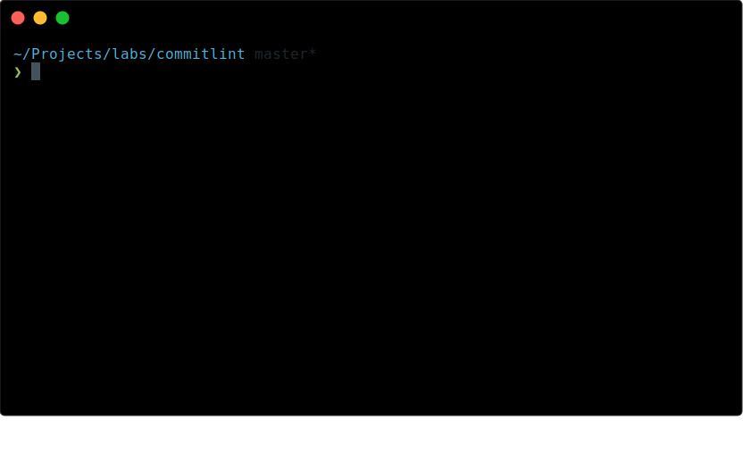

# [Get Started](https://commitlint.js.org/guides/getting-started) | [Website](https://commitlint.js.org)

> Lint commit messages

<p align="center">
  
</p>

> Demo generated with [svg-term-cli](https://github.com/marionebl/svg-term-cli)
>
> `cat docs/assets/commitlint.json | svg-term --out docs/assets/commitlint.svg --frame --profile=Seti --height=20 --width=80`

[![npm latest][2]][3] [![node compatibility][13]][14] [![Github Actions][4]][5]

- 🚓 Be a good `commitizen`
- 📦 Share configuration via `npm`
- 🤖 Tap into `conventional-changelog`

## Contents

- [Get Started | Website](#get-started--website)
  - [Contents](#contents)
  - [What is commitlint](#what-is-commitlint)
    - [Benefits of using commitlint](#benefits-of-using-commitlint)
  - [Getting started](#getting-started)
  - [CLI](#cli)
  - [Config](#config)
  - [Shared configuration](#shared-configuration)
  - [Documentation](#documentation)
  - [API](#api)
  - [Tools](#tools)
  - [Roadmap](#roadmap)
  - [Version Support and Releases](#version-support-and-releases)
    - [Releases](#releases)
  - [Related projects](#related-projects)
  - [License](#license)
  - [Development](#development)
    - [Install and run](#install-and-run)

---

## What is commitlint

commitlint checks if your commit messages meet the [conventional commit format](https://conventionalcommits.org).

In general the pattern mostly looks like this:

```sh
type(scope?): subject  #scope is optional; multiple scopes are supported (current delimiter options: "/", "\" and ",")
```

Real world examples can look like this:

```text
chore: run tests on travis ci
```

```text
fix(server): send cors headers
```

```text
feat(blog): add comment section
```

Common types according to [commitlint-config-conventional (based on the Angular convention)](https://github.com/conventional-changelog/commitlint/tree/master/@commitlint/config-conventional#type-enum) can be:

- build
- chore
- ci
- docs
- feat
- fix
- perf
- refactor
- revert
- style
- test

These can be modified by [your own configuration](#config).

### Benefits of using commitlint

- [Why Use Conventional Commits?](https://www.conventionalcommits.org/en/v1.0.0-beta.2/#why-use-conventional-commits)
- ["The perks of committing with conventions" (Talk slides)](https://slides.com/marionebl/the-perks-of-committing-with-conventions#/)

## Getting started

- [Local setup](https://commitlint.js.org/guides/local-setup) - Lint messages on commit with husky
- [CI setup](https://commitlint.js.org/guides/ci-setup) - Lint messages during CI builds

## CLI

- Primary way to interact with commitlint.
- `npm install --save-dev @commitlint/cli`
- Packages: [cli](./@commitlint/cli)

## Config

- Configuration is picked up from:
  - `.commitlintrc`
  - `.commitlintrc.json`
  - `.commitlintrc.yaml`
  - `.commitlintrc.yml`
  - `.commitlintrc.js`
  - `.commitlintrc.cjs`
  - `.commitlintrc.mjs`
  - `.commitlintrc.ts`
  - `.commitlintrc.cts`
  - `commitlint.config.js`
  - `commitlint.config.cjs`
  - `commitlint.config.mjs`
  - `commitlint.config.ts`
  - `commitlint.config.cts`
  - `commitlint` field in `package.json`
- Packages: [cli](./@commitlint/cli), [core](./@commitlint/core)
- See [Rules](./docs/reference/rules.md) for a complete list of possible rules
- An example configuration can be found at [@commitlint/config-conventional](./@commitlint/config-conventional/src/index.ts)

## Shared configuration

A number of shared configurations are available to install and use with `commitlint`:

- [@commitlint/config-angular](./@commitlint/config-angular)
- [@commitlint/config-conventional](./@commitlint/config-conventional)
- [@commitlint/config-lerna-scopes](./@commitlint/config-lerna-scopes)
- [@commitlint/config-nx-scopes](./@commitlint/config-nx-scopes)
- [@commitlint/config-patternplate](./@commitlint/config-patternplate)
- [conventional-changelog-lint-config-atom](https://github.com/erikmueller/conventional-changelog-lint-config-atom)
- [conventional-changelog-lint-config-canonical](https://github.com/gajus/conventional-changelog-lint-config-canonical)
- [commitlint-config-jira](https://github.com/Gherciu/commitlint-jira)

> ⚠️ If you want to publish your own shareable config then make sure it has a name aligning with the pattern `commitlint-config-emoji-log` or `commitlint-config-your-config-name` — then in extend all you have to write is `emoji-log` or `your-config-name`.

## Documentation

Check the [main website](https://commitlint.js.org/).

## API

- Alternative, programmatic way to interact with `commitlint`
- Packages:
  - [format](./@commitlint/format) - Format commitlint reports
  - [lint](./@commitlint/lint) - Lint a string against commitlint rules
  - [load](./@commitlint/load) - Load shared commitlint configuration
  - [read](./@commitlint/read) - Read commit messages from a specified range or last edit
- See [API](./docs/api) for a complete list of methods and examples

## Tools

- [commitizen adapter](./@commitlint/prompt)
- [prompt](./@commitlint/prompt-cli)

## Roadmap

`commitlint` is considered stable and is used in various projects as a development tool.

> **Ideas**: [conventional-changelog/commitlint#94](https://github.com/conventional-changelog/commitlint/issues/94)

## Version Support and Releases

- Node.js [LTS](https://github.com/nodejs/LTS#lts-schedule) `>= 18`
- git `>= 2.13.2`

### Releases

Security patches will be applied to versions which are not yet EOL.\
Features will only be applied to the current main version.

| Release                                                                          | Initial release |
| -------------------------------------------------------------------------------- | --------------- |
| [v18](https://github.com/conventional-changelog/commitlint/releases/tag/v18.0.0) | 10/2023         |
| [v17](https://github.com/conventional-changelog/commitlint/releases/tag/v17.0.0) | 05/2022         |
| [v16](https://github.com/conventional-changelog/commitlint/releases/tag/v16.0.0) | 12/2021         |
| [v15](https://github.com/conventional-changelog/commitlint/releases/tag/v15.0.0) | 11/2021         |
| [v14](https://github.com/conventional-changelog/commitlint/releases/tag/v14.0.0) | 10/2021         |
| [v13](https://github.com/conventional-changelog/commitlint/releases/tag/v13.0.0) | 05/2021         |
| [v12](https://github.com/conventional-changelog/commitlint/releases/tag/v12.0.0) | 02/2021         |
| [v11](https://github.com/conventional-changelog/commitlint/releases/tag/v11.0.0) | 09/2020         |

EOL is usually after around a year.

We're not a sponsored OSS project. Therefore we can't promise that we will release patch versions for older releases in a timely manner.\
If you are stuck on an older version and need a security patch we're happy if you can provide a PR.

## Related projects

- [conventional-changelog](https://github.com/conventional-changelog/conventional-changelog)
  Generate a changelog from conventional commit history
- [commitizen](https://github.com/commitizen/cz-cli)
  Simple commit conventions for internet citizens
- [create-semantic-module](https://github.com/jlegrone/create-semantic-module)
  CLI for quickly integrating commitizen and commitlint in new or existing projects

## License

Copyright by @marionebl. All `commitlint` packages are released under the MIT license.

## Development

`commitlint` is developed in a mono repository.

### Install and run

```sh
git clone git@github.com:conventional-changelog/commitlint.git
cd commitlint
yarn
yarn run build # run build tasks
yarn start # run tests, again on change
yarn run commitlint # run CLI
```

For more information on how to contribute please take a look at our [contribution guide](./.github/CONTRIBUTING.md).

[0]: https://img.shields.io/badge/stability-stable-green.svg?style=flat-square
[1]: https://nodejs.org/api/documentation.html#documentation_stability_index
[2]: https://img.shields.io/npm/v/@commitlint/cli.svg?style=flat-square
[3]: https://npmjs.org/package/@commitlint/cli
[4]: https://github.com/conventional-changelog/commitlint/actions/workflows/CI.yml/badge.svg
[5]: https://github.com/conventional-changelog/commitlint/actions/workflows/CI.yml
[8]: https://img.shields.io/badge/stability-experimental-orange.svg?style=flat-square
[9]: https://nodejs.org/api/documentation.html#documentation_stability_index
[10]: https://img.shields.io/npm/v/@commitlint/cli/next.svg?style=flat-square
[13]: https://img.shields.io/node/v/@commitlint/cli.svg
[14]: https://nodejs.org/en/about/previous-releases
